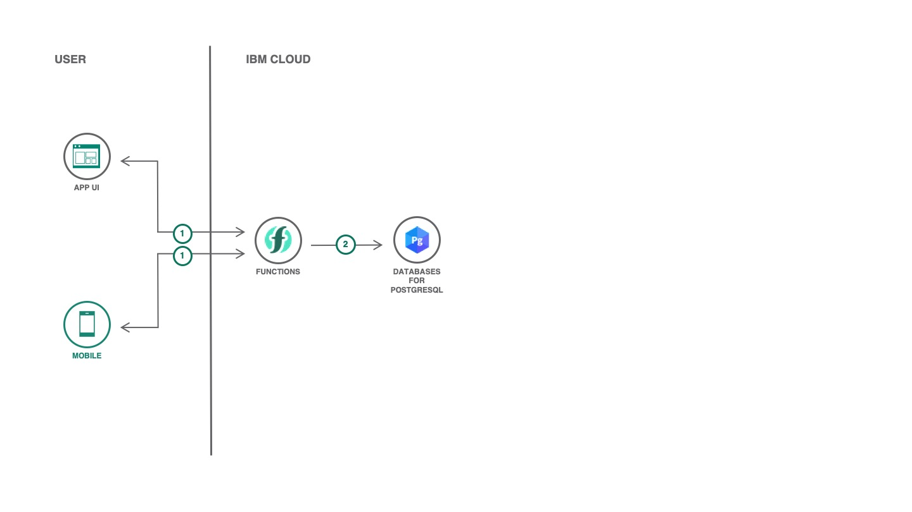

# Serverless Daily Task

[](https://cloud.ibm.com)
[](https://developer.ibm.com/technologies/node-js/)
[](https://github.com/victorshinya/serverless-dailytask/blob/master/LICENSE)
[](https://github.com/victorshinya/serverless-dailytask/pulls)

A Serverless back-end to manage requests on PostgreSQL, including creating a new table and automated backup.



## Components and technologies

* [IBM Cloud Functions](https://cloud.ibm.com/functions): IBM Cloud Functions is a Function-as-a-Service (FaaS) platform which executes functions in response to incoming events.
* [PostgreSQL](https://cloud.ibm.com/catalog/services/databases-for-postgresql): Postgres is a powerful, open source object-relational database that is highly customizable.

## Deployment

To deploy, you need to install [IBM Cloud CLI](https://cloud.ibm.com/docs/cli/reference/ibmcloud/download_cli.html#install_use) and [IBM Cloud Functions CLI](https://cloud.ibm.com/openwhisk/learn/cli) in your local machine. After this step, you need to login in your IBM Cloud account on IBM Cloud CLI (if you haven't already done, run `ibmcloud login`), follow all steps below.

### 1. Clone this repository

```sh
git clone https://github.com/victorshinya/serverless-dailytask.git
cd serverless-dailytask
```

### 2. Open the project in a text editor

Replace on [`create.js`](src/admin/create.js):

* [ Line 2 ] `{cert}` by your PostgreSQL's certificate.
* [ Line 6 ] `{host}` by your PostgreSQL's hostname.
* [ Line 7 ] `{port}` by your PostgreSQL's port.
* [ Line 8 ] `{user}` by your PostgreSQL's username.
* [ Line 9 ] `{password}` by your PostgreSQL's password.
* [ Line 10 ] `{database}` by your PostgreSQL's database name.

Replace on [`delete.js`](src/baas/delete.js):

* [ Line 2 ] `{cert}` by your PostgreSQL's certificate.
* [ Line 6 ] `{host}` by your PostgreSQL's hostname.
* [ Line 7 ] `{port}` by your PostgreSQL's port.
* [ Line 8 ] `{user}` by your PostgreSQL's username.
* [ Line 9 ] `{password}` by your PostgreSQL's password.
* [ Line 10 ] `{database}` by your PostgreSQL's database name.

Replace on [`insert.js`](src/baas/insert.js):

* [ Line 2 ] `{cert}` by your PostgreSQL's certificate.
* [ Line 6 ] `{host}` by your PostgreSQL's hostname.
* [ Line 7 ] `{port}` by your PostgreSQL's port.
* [ Line 8 ] `{user}` by your PostgreSQL's username.
* [ Line 9 ] `{password}` by your PostgreSQL's password.
* [ Line 10 ] `{database}` by your PostgreSQL's database name.

Replace on [`select.js`](src/baas/select.js):

* [ Line 2 ] `{cert}` by your PostgreSQL's certificate.
* [ Line 6 ] `{host}` by your PostgreSQL's hostname.
* [ Line 7 ] `{port}` by your PostgreSQL's port.
* [ Line 8 ] `{user}` by your PostgreSQL's username.
* [ Line 9 ] `{password}` by your PostgreSQL's password.
* [ Line 10 ] `{database}` by your PostgreSQL's database name.

Replace on [`update.js`](src/baas/update.js):

* [ Line 2 ] `{cert}` by your PostgreSQL's certificate.
* [ Line 6 ] `{host}` by your PostgreSQL's hostname.
* [ Line 7 ] `{port}` by your PostgreSQL's port.
* [ Line 8 ] `{user}` by your PostgreSQL's username.
* [ Line 9 ] `{password}` by your PostgreSQL's password.
* [ Line 10 ] `{database}` by your PostgreSQL's database name.

### 3. Deploy all functions

Run the following command to deploy both `create.js`, `delete.js`, `insert.js`, `select.js`, `update.js` functions. It requires an account on [IBM Cloud](https://cloud.ibm.com).

> As you are using IBM Cloud Functions, you don't need to install any package or setup a `package.json`. The platform already has the package installed.

```sh
ibmcloud fn deploy --manifest serverless.yml
```

## LICENSE

Copyright 2020 Victor Shinya

Licensed under the Apache License, Version 2.0 (the "License");
you may not use this file except in compliance with the License.
You may obtain a copy of the License at

    http://www.apache.org/licenses/LICENSE-2.0

Unless required by applicable law or agreed to in writing, software
distributed under the License is distributed on an "AS IS" BASIS,
WITHOUT WARRANTIES OR CONDITIONS OF ANY KIND, either express or implied.
See the License for the specific language governing permissions and
limitations under the License.
